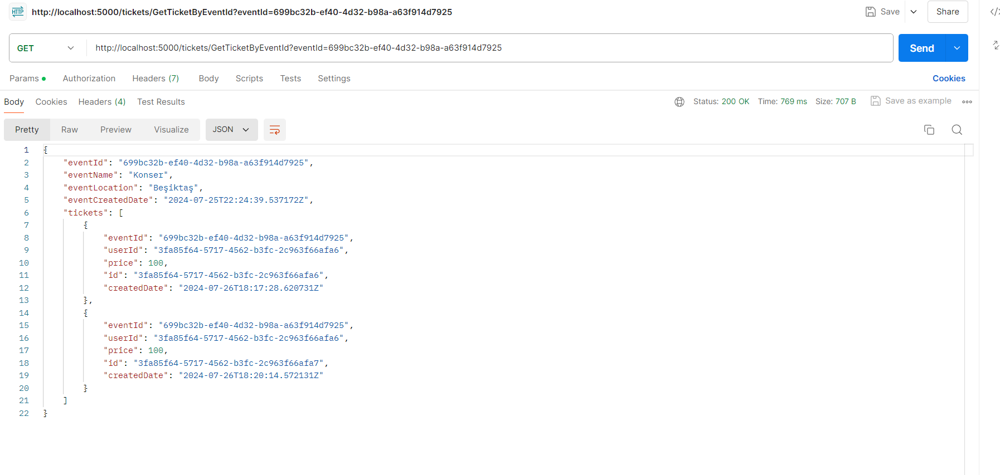

# MicroService.Example

MicroService.Example is a project developed to learn and apply fundamental microservice architecture principles. This project includes API Gateway (Ocelot), JWT authentication, Ocelot caching, load balancing, rate limiting, and basic microservice communication.

## Features

- **API Gateway**: Routing and API Gateway functionality using Ocelot.
- **Authentication and Authorization**: Secure access with JWT-based authentication.
- **Ocelot Caching**: Performance improvement with caching provided by Ocelot.
- **Load Balancing**: Distributing requests among multiple microservices with Ocelot's support.
- **Rate Limiting**: Controlling and limiting requests with rate limiting provided by Ocelot.
- **Logging**: Centralized logging using console logging.
- **Microservice Communication**: Communication and data exchange between services.

## Technologies Used

- ASP.NET Core
- Ocelot API Gateway
- JWT Authentication
- Ocelot Caching
- Ocelot Load Balancing
- Ocelot Rate Limiting
- Console Logging
- .NET Core 8

## Getting Started

### Prerequisites

- .NET 8 SDK

### Installation

1. Clone the repository:
    ```sh
    git clone https://github.com/anilklc/MicroService.Example.git
    ```
2. Navigate to the project directory:
    ```sh
    cd MicroService.Example
    ```
3. Update the API Gateway and microservices configurations in the `appsettings.json` file.
4. Check and modify the Ocelot caching, load balancing, and rate limiting configurations in the `ocelot.json` file as needed.
5. Run the application:
    ```sh
    dotnet run
    ```

### Screenshots





### License

This project is licensed under the MIT License.
